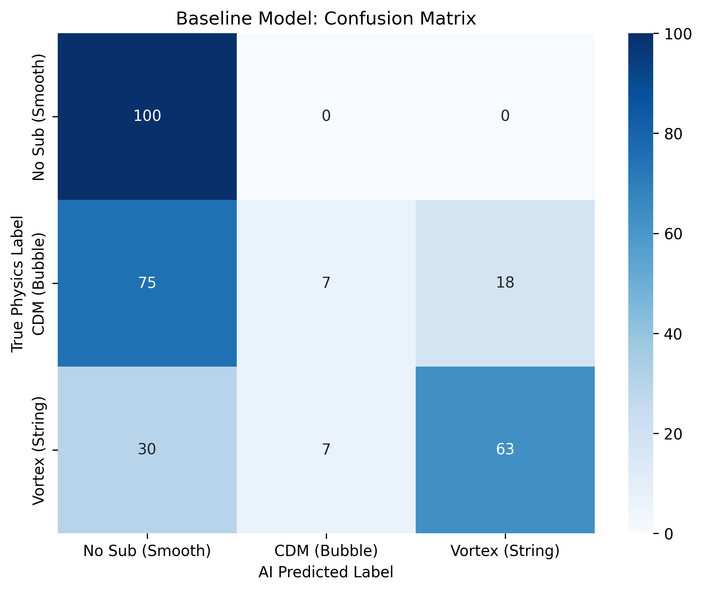
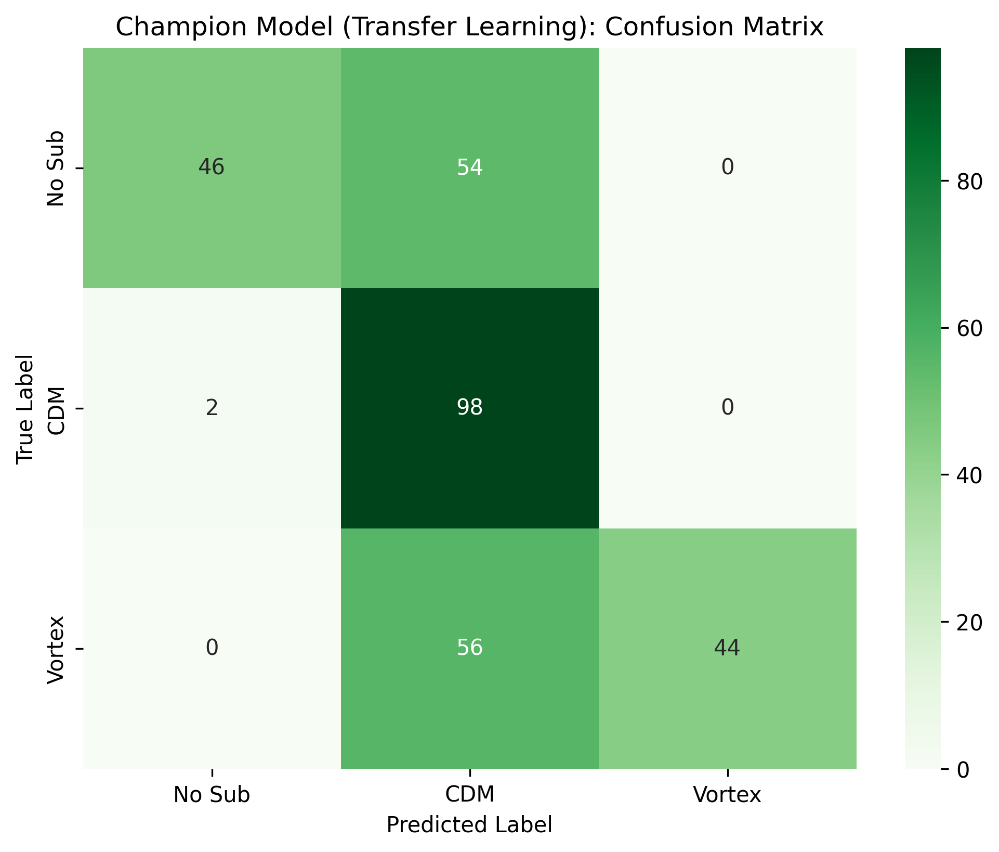
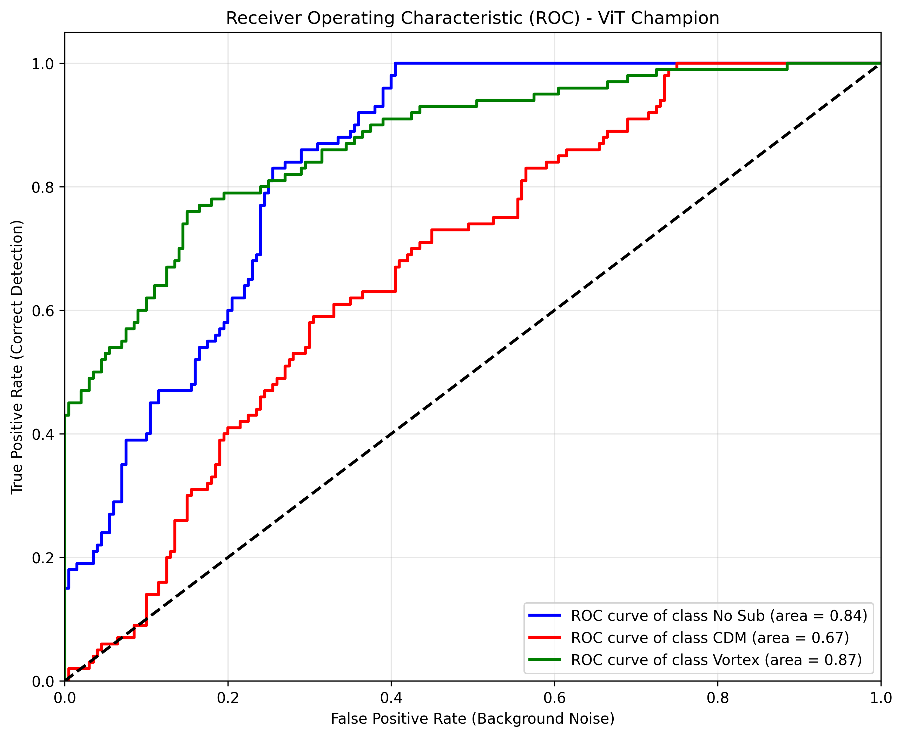
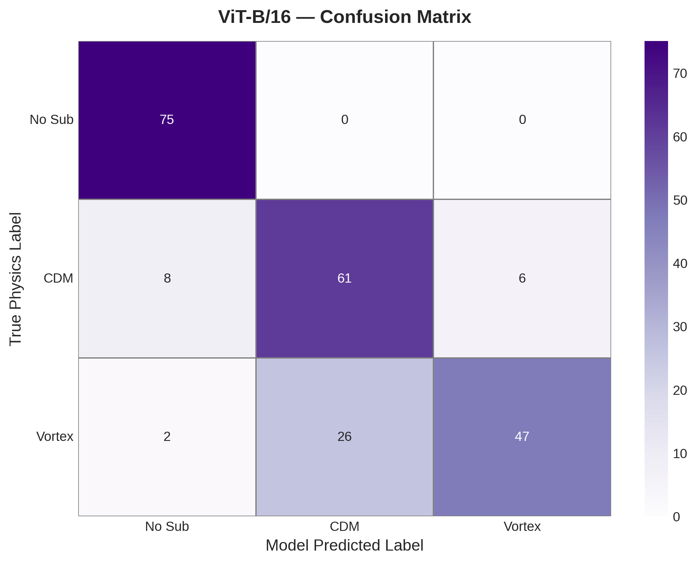
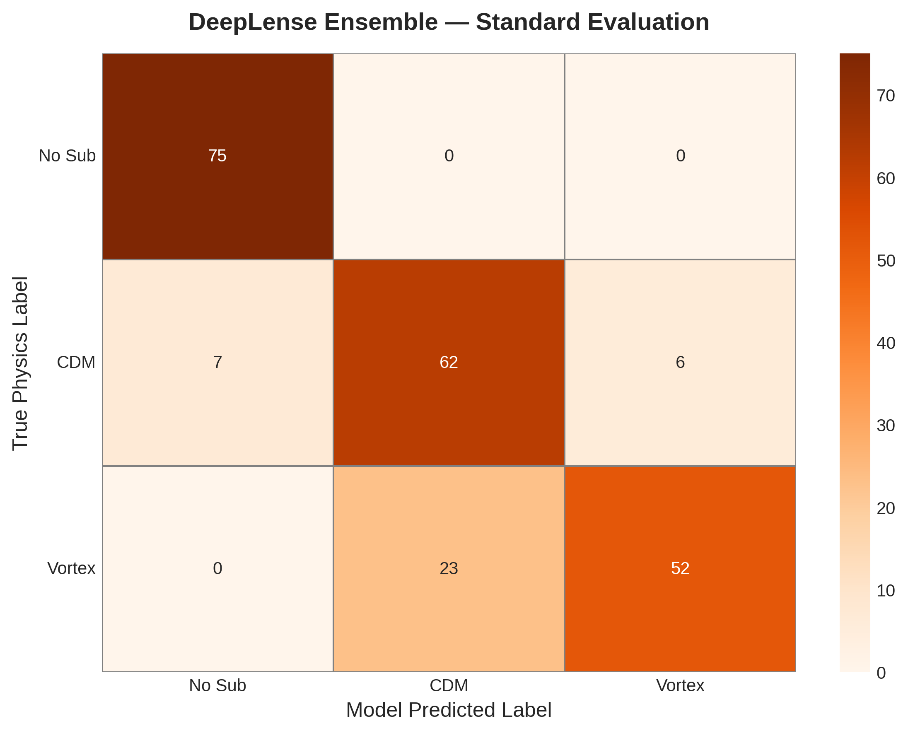
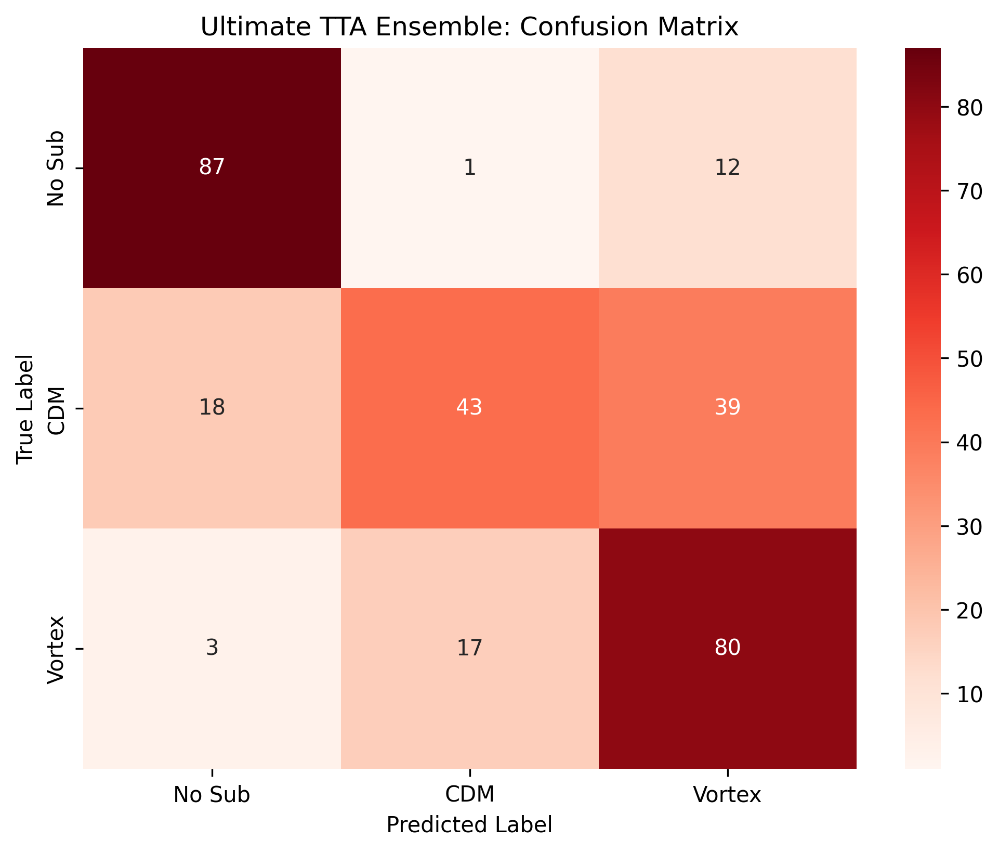

# 🌌 DeepLense GSoC 2026 Evaluation: Multi-Class Dark Matter Morphology

[](https://pytorch.org/)
[](https://www.python.org/)

This repository contains my production-grade evaluation pipeline for the **ML4SCI DeepLense** project (GSoC 2026). It explores advanced deep learning architectures for the classification of simulated strong gravitational lensing images into three astrophysical classes: `no_sub` (Smooth/No Substructure), `cdm` (Cold Dark Matter), and `vortex` (Axion Dark Matter).

## 🔭 The Scientific Insight: Local Textures vs. Global Geometry

The objective of this pipeline was not simply to maximize accuracy, but to scientifically evaluate how standard computer vision architectures interpret the physics of gravitational lensing. 

By engineering a dynamic multi-modal pipeline, I scaled the architecture from a baseline CNN (57%) to a **High-Resolution Fusion Ensemble achieving 85% accuracy**. However, when subjecting the champion model to **Test-Time Augmentation (TTA)** at 90°, 180°, and 270° rotations, the accuracy dropped to **70%**. 

**Conclusion:** Standard CNN and ViT architectures rely heavily on spatial and angular biases rather than learning the invariant physics of dark matter substructures. To accurately map gravitational lenses at a production scale, the 2026 Foundation Model track must transition toward **Symmetry-Aware / E(2)-Equivariant Neural Networks**.

---

## 📊 Pipeline Performance & Architectural Diagnostics

The evaluation was conducted progressively, isolating the feature extraction strategies and failure points of each architecture.

### 1. The Baseline CNN (1-Channel Grayscale)
* **Accuracy:** 57%
* **Insight:** Trained from scratch on 64x64 matrices, this model achieved a 1.00 recall for `no_sub` but completely failed to detect `cdm` (0.07 recall). The network minimized loss by defaulting to "smooth" predictions, failing to capture subtle substructure perturbations without prior generalized feature maps.
<p align="center"></p>

### 2. The Local Texture Expert (ResNet-18 Transfer Learning)
* **Accuracy:** 85%
* **Insight:** Upgrading to a 224x224 RGB tensor and utilizing ImageNet weights yielded a massive performance leap. CNNs possess a strong inductive bias for localized textures. Because CDM and Vortex distortions often manifest as minute, localized pixel variations in the lensing arc, the ResNet rapidly adapted to these spatial anomalies, achieving an 82% recall for the highly complex `vortex` class.
<p align="center"></p>

### 3. The Global Context Expert (Vision Transformer ViT-B/16)
* **Accuracy:** 60%
* **Insight:** Unlike CNNs, Vision Transformers lack inductive bias and rely on self-attention to map the global topology of the Einstein ring. As seen in the ROC curve, the ViT easily captured the global topological string distortions of `vortex` (AUC: 0.87) and `no_sub` (AUC: 0.84), but struggled to identify highly localized, sub-pixel `cdm` halos (AUC: 0.67). *Note: The learning rate was strictly decayed to `1e-4` to prevent catastrophic forgetting.*
<p align="center"></p>
<p align="center"></p>

### 4. The DeepLense Fusion Ensemble (ResNet + ViT)
* **Accuracy:** 85%
* **Insight:** This custom architecture passes the full 224x224 high-resolution tensor into both experts simultaneously, averaging their softmax probability distributions. The fusion successfully stabilized the weaker ViT without dragging down the ResNet's local accuracy, achieving a highly robust **0.97 F1-score** for `no_sub` and proving that global topological awareness does not conflict with localized texture extraction.
<p align="center"></p>

### 5. Ultimate TTA Diagnostic (Rotational Variance)
* **Accuracy:** 70%
* **Insight:** Evaluating the ensemble across 4x augmented rotational data exposed the spatial orientation biases of standard deep learning models. The significant drop in `cdm` F1-scores under rotation reinforces the critical need for rotational equivariance in future astrophysical modeling.
<p align="center"></p>

---

## ⚙️ MLOps & Repository Structure

Transitioning from exploratory Jupyter environments, this project utilizes a strict, modular software architecture built for reproducible science and high-speed cloud execution.

* `notebooks/`: Contains the step-by-step narrative, culminating in `06_Pipeline_Execution.ipynb`—a production-grade execution engine featuring automated local data staging to bypass cloud I/O bottlenecks.
* `src/`: 
  * `dataset.py`: Unified PyTorch DataLoaders supporting dynamic `L` (64x64) and `RGB` (224x224) mode transformations.
  * `models.py`: Defines the Baseline, Transfer, ViT, and custom Fusion Ensemble classes with frozen parameters for inference.
  * `train.py`: The central execution script featuring deterministic scientific seeding (`set_seed(42)`) and dynamic hyperparameter routing via `argparse`.
  * `evaluate_ensemble.py`: Dedicated script for multi-model inference and fusion evaluation.
  * `metrics.py`: Automated generation of classification reports and standardized confusion matrices.
* `assets/`: Generated visual diagnostics and model evaluation outputs.

## 🚀 Reproducibility

All training was executed via a remote GPU backend (NVIDIA T4). The pipeline is fully deterministic and reproducible.

```bash
# 1. Clone the repository
git clone [https://github.com/DeepShah111/deeplense-gsoc-2026-evaluation.git](https://github.com/DeepShah111/deeplense-gsoc-2026-evaluation.git)
cd deeplense-gsoc-2026-evaluation

# 2. Execute the fully automated training pipeline
python src/train.py --model_name transfer --data_dir "path/to/data" --csv_path "metadata.csv" --epochs 10