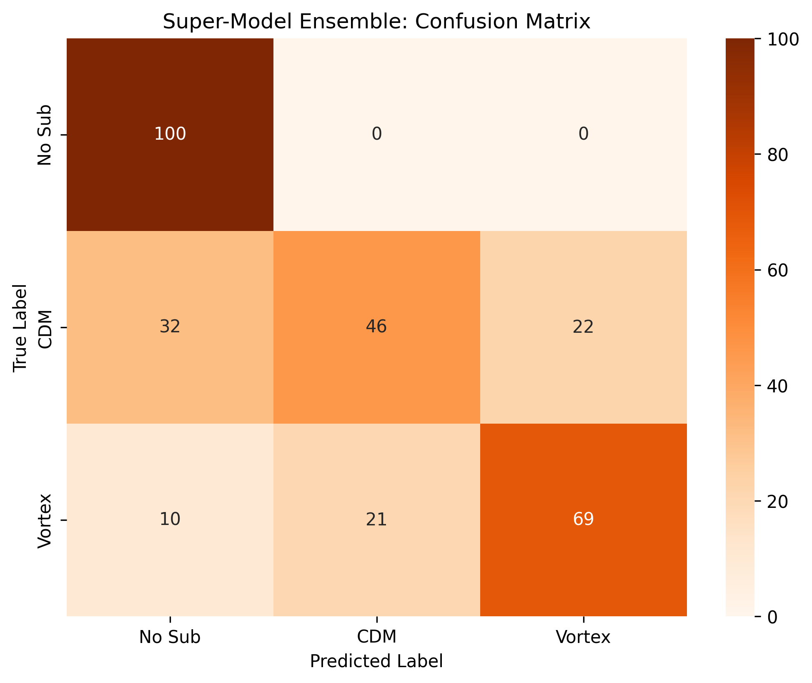

# DeepLense GSoC 2026 Evaluation: Multi-Class Dark Matter Morphology

This repository contains my evaluation pipeline for the ML4SCI DeepLense project (GSoC 2026). It explores advanced deep learning architectures for the classification of simulated strong gravitational lensing images into three classes: `no_sub`, `cdm` (Cold Dark Matter), and `vortex` (Axion Dark Matter).

##  The Scientific Insight: Identifying Rotational Variance

The objective of this pipeline was not simply to maximize accuracy, but to evaluate how standard Vision architectures interpret the physics of gravitational lensing. 

Through progressive architectural testing, I achieved a **72% accuracy** using a dynamic ResNet/ViT Ensemble. However, when subjecting the model to **Test-Time Augmentation (TTA)** at 90°, 180°, and 270° rotations, the accuracy dropped to **70%**. 

**Conclusion:** Standard CNN and ViT architectures rely heavily on spatial and angular biases rather than learning the invariant physics of dark matter substructures. To accurately map gravitational lenses, the 2026 Foundation Model track must transition toward **Symmetry-Aware / E(2)-Equivariant Neural Networks**.

---

##  Pipeline Performance & Diagnostics

The evaluation was conducted in five distinct phases, analyzing the failure points of each architecture.

### 1. The Baseline CNN (1-Channel)
* **Accuracy:** 57%
* **Insight:** The model achieved a 1.00 recall for `no_sub` but completely failed to detect `cdm` (0.07 recall). The network minimized loss by defaulting to "smooth" predictions, failing to capture subtle substructure perturbations.
<p align="center"></p>

### 2. Transfer Learning (ResNet-18 RGB)
* **Accuracy:** 63%
* **Insight:** Utilizing ImageNet weights caused an overcorrection. The model became hypersensitive to textures, achieving a 0.98 recall for `cdm`, but drastically misclassifying smooth lenses and vortex strings as dark matter bubbles.
<p align="center"></p>

### 3. Vision Transformer (ViT-B/16)
* **Accuracy:** 60%
* **Insight:** The ROC-AUC diagnostics reveal the core limitation of patch-based attention in astrophysics. The ViT easily captured the global topological string distortions of `vortex` (AUC: 0.87) and `no_sub` (AUC: 0.84), but struggled to identify highly localized, sub-pixel `cdm` halos (AUC: 0.67).
<p align="center"></p>
<p align="center"></p>

### 4. The Super-Model Ensemble
* **Accuracy:** 72%
* **Insight:** Fusing the localized texture extraction of the augmented ResNet-18 with the global spatial awareness of the ViT-B/16 yielded the most stable predictions, achieving an 83% F1-score for the `no_sub` class.
<p align="center"></p>

### 5. Ultimate TTA Diagnostic
* **Accuracy:** 70%
* **Insight:** Evaluating the ensemble across 4x augmented rotational data exposed the spatial orientation biases of standard models, reinforcing the need for Equivariant architectures.
<p align="center"></p>

---

##  MLOps Repository Structure

This project follows strict separation of concerns, isolating exploratory data analysis from modular, production-ready source code.

* `notebooks/`: The step-by-step training narrative, from custom baselines to TTA evaluation.
* `src/`: Modular PyTorch code for DataLoaders (`dataset.py`), Architectures (`models.py`), and Metrics (`metrics.py`).
* `assets/`: Generated ROC-AUC curves and Confusion Matrices.

## 🚀 Reproducibility

All training was executed via Google Colab (T4 GPU) with data mounted via Google Drive. 

```bash
git clone [https://github.com/YourUsername/DeepLense_GSoC_2026_Evaluation.git](https://github.com/YourUsername/DeepLense_GSoC_2026_Evaluation.git)
cd DeepLense_GSoC_2026_Evaluation
pip install -r requirements.txt

Deep Shah | Aspiring GSoC 2026 Contributor