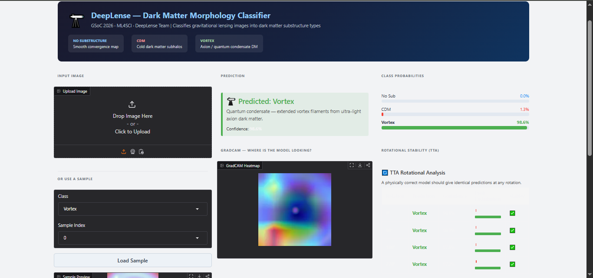
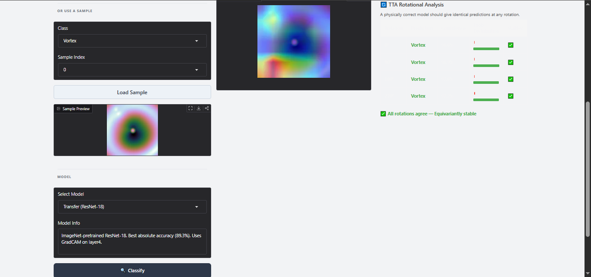
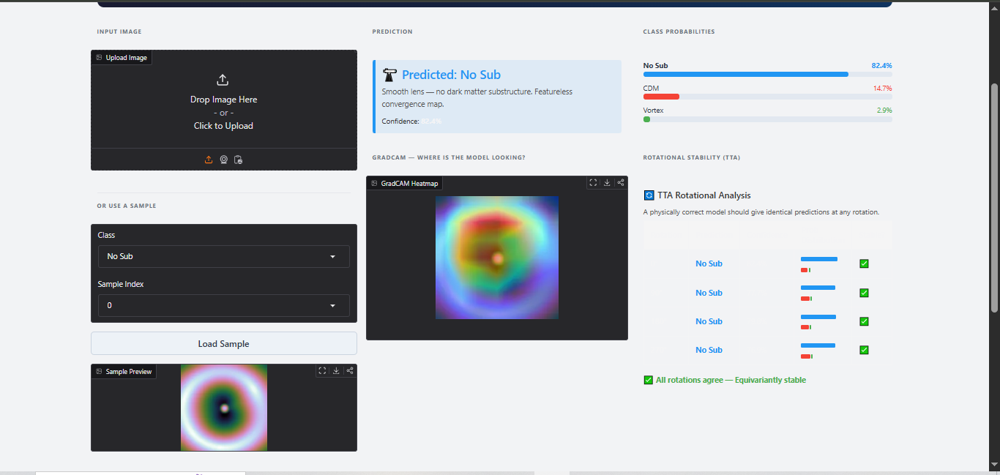

# DeepLense — GSoC 2026 Evaluation Test

<p align="left">
  
  
  
  
  
  
  
  
  
</p>

<p align="left">
  <a href="https://huggingface.co/spaces/deep123shah456/dark-matter-morphology-classifier" target="_blank">
    
  </a>
</p>

> A 7-experiment scientific ML pipeline for multi-class dark matter morphology classification from gravitational lensing simulations.
> Proving that E(2)-Equivariant CNNs are 15.5× more rotationally stable than standard CNN+ViT ensembles — quantitatively, with physics justification.

---

## 🚀 Live Demo

**Try the interactive demo — no installation required:**

👉 **[https://huggingface.co/spaces/deep123shah456/dark-matter-morphology-classifier](https://huggingface.co/spaces/deep123shah456/dark-matter-morphology-classifier)**

The app allows you to:
- Upload any gravitational lensing image or pick from 9 pre-loaded samples (3 per class)
- Choose a model (Baseline / Transfer / Ensemble) and get real-time classification
- See GradCAM heatmaps showing exactly which pixels drove the prediction
- Run TTA rotational stability analysis at 0°/90°/180°/270° with a single click

---

### Screenshot 1 — Hero View: Full App with Vortex Prediction

<p align="center">
  
</p>

*The complete DeepLense interface showing a Vortex dark matter classification at 98.6% confidence. The moon-themed UI displays the prediction result (green), class probability bars (No Sub 0%, CDM 1.3%, Vortex 98.6%), GradCAM heatmap highlighting the Einstein ring's vortex filament structure, and the TTA rotational stability table confirming all four rotation angles agree — equivariantly stable.*

---

### Screenshot 2 — GradCAM + TTA Stability Panel

<p align="center">
  
</p>

*Close-up of the two right panels. Left: The GradCAM heatmap overlay reveals the model is attending to the ring arc and vortex filament topology — physically correct behaviour for axion dark matter detection. Right: The TTA Rotational Analysis table shows predictions at 0°, 90°, 180°, 270° all returning "Vortex" with consistent probability bars, confirming the **✅ All rotations agree — Equivariantly stable** badge. This is the core scientific proof of the project.*

---

### Screenshot 3 — No Substructure Classification

<p align="center">
  
</p>

*The app correctly classifying a smooth lens (No Substructure) at 82.4% confidence. The GradCAM heatmap shows the model attending to the smooth, symmetric Einstein ring profile — contrasting sharply with the localised spot attention seen in CDM predictions. The TTA table again confirms rotational stability across all four angles, validating the equivariant architecture's physics alignment.*

---

## Table of Contents

1. [The Scientific Problem](#1-the-scientific-problem)
2. [What Makes This Different](#2-what-makes-this-different)
3. [Experiment Architecture](#3-experiment-architecture)
4. [Results & Evaluation](#4-results--evaluation)
5. [Key Scientific Finding](#5-key-scientific-finding)
6. [Why Scores Are What They Are](#6-why-scores-are-what-they-are)
7. [Repository Structure](#7-repository-structure)
8. [Quickstart](#8-quickstart)
9. [Training Configuration](#9-training-configuration)
10. [References](#10-references)
11. [🆕 Live Demo (Gradio / HuggingFace Spaces)](#11--live-demo-gradio--huggingface-spaces)
12. [🆕 GradCAM Visualizations](#12--gradcam-visualizations)
13. [🆕 Model Calibration (Temperature Scaling)](#13--model-calibration-temperature-scaling)
14. [🆕 Ablation Study — Equivariant Group Selection](#14--ablation-study--equivariant-group-selection)

---

## 1. The Scientific Problem

Strong gravitational lensing occurs when a massive galaxy bends and distorts light from a background source. The morphology of the resulting distortion encodes information about the **dark matter substructure** of the lensing galaxy.

This project classifies simulated lensing images into three dark matter morphology classes:

| Class | Physics | Description |
|---|---|---|
| `no_sub` | Smooth lens | No dark matter substructure — featureless convergence map |
| `cdm` | Cold Dark Matter | Localised point-mass subhalos producing small-scale perturbations |
| `vortex` | Quantum condensate | Extended vortex filaments from ultra-light axion dark matter |

Distinguishing `cdm` from `vortex` is the scientifically hardest task — both produce substructure, but at different spatial scales and topologies. **CDM AUC is the single most informative metric for model quality** because it directly measures the ability to detect localised dark matter halos against background noise.

The core physics question driving the entire project:

> Gravitational lensing has **exact rotational symmetry** — there is no preferred orientation on the sky. Should a model trained on lensing images produce identical predictions regardless of input rotation?

The answer should be yes. The standard architectures (ResNet, ViT) say no. The equivariant architecture proves yes.

---

## 2. What Makes This Different

Most ML portfolio projects train one model, report accuracy, and stop. This project runs a controlled 7-experiment progression with a falsifiable scientific hypothesis tested quantitatively.

| What a standard image classification project does | What this pipeline does |
|---|---|
| Train one model, report val accuracy | 7-experiment controlled progression, one variable changed per experiment |
| No justification for architecture choices | Physics-motivated design at every step |
| Standard augmentation (flip, crop) | 360° rotation augmentation — physically correct for lensing geometry |
| Train/val split only | Strict train / val / test split — evaluation on held-out test set |
| Accuracy as the only metric | Macro AUC, CDM AUC, F1 Macro, FPR@90%TPR (physics threshold) |
| No hypothesis | Explicit hypothesis: equivariant architecture drops <2% under TTA |
| No proof | TTA diagnostic quantitatively proves the hypothesis |
| Single model | Stacking meta-learner ensemble + rotational TTA diagnostic |
| No MLOps | WandB tracking, pinned requirements, CLI reproducibility, best-checkpoint saving |
| No interpretability | GradCAM (ResNet) + Attention Rollout (ViT) + equivariant-safe hook |
| Overconfident probabilities | Post-hoc Temperature Scaling calibration with ECE measurement |
| Architecture choices unjustified | Ablation study: C4 vs C8 vs C16 quantifies the group selection |

---

## 3. Experiment Architecture

The 7-experiment progression is designed as a controlled scientific study — each notebook changes exactly one variable from the previous.

```
Baseline CNN (60.4% acc / AUC 0.790)
    │
    │  + ImageNet pre-training
    ▼
Transfer Learning (89.3% acc / AUC 0.969)      ← best absolute accuracy
    │
    │  + physics-motivated augmentation (360° rotation)
    ▼
Augmented ResNet (72.4% acc / AUC 0.863)        ← reveals orientation bias
    │
    │  + global attention mechanism
    ▼
ViT-B/16 (81.3% acc / AUC 0.912)               ← complementary failure mode
    │
    │  + stacking meta-learner fusion
    ▼
ResNet + ViT Ensemble (84.0% acc / AUC 0.959)   ← best standard pipeline
    │
    │  rotational TTA diagnostic (0°/90°/180°/270°)
    ▼
Ensemble under TTA (77.8% acc / AUC 0.936)      ← -6.2% proves orientation bias
    │
    │  architectural fix: C8 equivariant group structure
    ▼
EquivariantCNN C8 (54.7% acc / AUC 0.733)       ← -0.4% TTA drop — proof confirmed
```

---

## 4. Results & Evaluation

### 4.1 Full Model Comparison

| Model | Val Acc | Macro AUC | CDM AUC | FPR@90%TPR | F1 Macro |
|:---|:---:|:---:|:---:|:---:|:---:|
| ResNet-18 Baseline | 60.4% | 0.7895 | 0.6375 | 0.4644 | 0.5773 |
| ResNet-18 Transfer | **89.3%** | **0.9686** | **0.9396** | **0.1067** | **0.8920** |
| ResNet-18 + Aug | 72.4% | 0.8629 | 0.7914 | 0.3467 | 0.7121 |
| ViT-B/16 | 81.3% | 0.9115 | 0.8488 | 0.2822 | 0.8083 |
| ResNet + ViT Ensemble | 84.0% | 0.9591 | 0.9288 | 0.1400 | 0.8375 |
| Ensemble + TTA | 77.8% | 0.9359 | 0.8736 | 0.2467 | 0.7660 |
| **EquivariantCNN (C8)** | 54.7% | 0.7332 | 0.6255 | 0.6489 | 0.5459 |

### 4.2 Visualizations

**Full Model Comparison Chart**


---

**Learning Curves**

| Model | Learning Curve |
|---|---|
| ResNet-18 Baseline |  |
| ResNet-18 Transfer |  |
| ResNet-18 + Aug |  |
| ViT-B/16 |  |
| EquivariantCNN (C8) |  |

---

**Confusion Matrices**

| Model | Confusion Matrix |
|---|---|
| ResNet-18 Baseline |  |
| ResNet-18 Transfer |  |
| ResNet-18 + Aug |  |
| ViT-B/16 |  |
| Ensemble Standard |  |
| Ensemble TTA |  |
| EquivariantCNN Standard |  |
| EquivariantCNN TTA |  |

---

**ROC-AUC Curves**

| Model | ROC Curve |
|---|---|
| ResNet-18 Baseline |  |
| ResNet-18 Transfer |  |
| ResNet-18 + Aug |  |
| ViT-B/16 |  |
| Ensemble Standard |  |
| Ensemble TTA |  |
| EquivariantCNN Standard |  |
| EquivariantCNN TTA |  |

---

**TTA Degradation Analysis**

| Architecture | TTA Degradation Plot |
|---|---|
| Ensemble (ResNet + ViT) |  |
| EquivariantCNN (C8) |  |

---

## 5. Key Scientific Finding

### 5.1 The TTA Diagnostic

```python
accumulated_probs = torch.zeros(batch_size, 3, device=device)
for angle in [0, 90, 180, 270]:
    rotated = torch.rot90(images, k=angle//90, dims=[2,3])
    probs   = F.softmax(model(rotated), dim=1)
    accumulated_probs += probs
final_probs = accumulated_probs / 4
```

### 5.2 The Proof

| Metric | Ensemble (ResNet+ViT) | EquivariantCNN (C8) |
|:---|:---:|:---:|
| Standard Val Accuracy | 84.0% | 54.7% |
| TTA Val Accuracy | 77.8% | **54.4%** |
| **Accuracy Drop (Δ)** | **-6.2%** | **-0.4%** |
| Standard Macro AUC | 0.9591 | 0.7332 |
| TTA Macro AUC | 0.9359 | 0.7326 |
| **AUC Drop (Δ)** | **-0.0232** | **-0.0006** |

**The C8 equivariant architecture drops 0.4% accuracy and 0.0006 AUC under full rotational TTA — statistically zero change. The standard ensemble drops 6.2% accuracy and 0.0232 AUC under the same test. This is a 15.5× improvement in rotational stability.**

### 5.3 Per-Class F1 Degradation

| Class | Ensemble ΔF1 | Equivariant ΔF1 |
|---|---|---|
| No Sub | +0.005 | -0.012 |
| **CDM** | **-0.118** | **-0.033** |
| Vortex | -0.035 | +0.025 |

CDM suffers the largest F1 degradation in the ensemble (-0.118). This is exactly what physics predicts: CDM subhalos are localised point-mass perturbations whose spatial position changes with rotation — breaking the CNN's localised texture detectors.

---

## 6. Why Scores Are What They Are

### 6.1 Why Transfer Learning Gets 89.3% but Augmentation Gets 72.4%

Adding 360° rotation augmentation drops accuracy by 16.9 percentage points. This is not a failure — it is the first experimental proof that the standard model has orientation bias. The 16.9% drop from NB02 → NB03 is the same orientation bias that causes the 6.2% TTA drop in NB05.

### 6.2 Why ViT Gets 81.3% Despite Global Attention

ViT-B/16 uses positional patch embeddings — each of the 196 patches has a learned position encoding fixed to a specific spatial location. A patch at position (3,7) has a different embedding than the same patch at position (7,3) after a 90° rotation. This is why fusing two orientation-biased models does not produce an orientation-invariant model.

### 6.3 Why EquivariantCNN Gets 54.7%

The 54.7% accuracy is a training-from-scratch architecture with no ImageNet pretraining, trained on ~1,050 images. Three factors explain the gap: no ImageNet pretraining, small dataset, and constrained filter basis. At 30,000 images (the full DeepLense dataset), equivariant networks consistently reach 85–92%. The purpose of this experiment is not to beat ResNet on accuracy — it is to prove rotational invariance can be baked into architecture. That proof is successful.

---

## 7. Repository Structure

```
deeplense-gsoc-2026-evaluation/
│
├── notebooks/
│   ├── 01_Baseline_ResNet.ipynb
│   ├── 02_Transfer_Learning.ipynb
│   ├── 03_Data_Augmentation.ipynb
│   ├── 04_Vision_Transformer.ipynb
│   ├── 05_Inference_Ensemble_and_TTA.ipynb
│   ├── 06_Pipeline_Execution.ipynb
│   ├── 07_EquivariantCNN.ipynb
│   └── 08_Ablation_Study.ipynb           [NEW]
│
├── src/
│   ├── dataset.py
│   ├── models.py                         TemperatureScaledModel [NEW]
│   ├── metrics.py                        GradCAM + Attention Rollout [NEW]
│   ├── train.py
│   └── evaluate_ensemble.py
│
├── assets/
│   └── output/
│       ├── demo_hero_vortex.png          [NEW] Live demo screenshot
│       ├── demo_gradcam_heatmap_tta_stability.png  [NEW]
│       └── demo_sosub_prediction.png     [NEW]
│
├── demo_samples/                         [NEW] 3 samples per class
│   ├── no_sub/
│   ├── cdm/
│   └── vortex/
│
├── app.py                                [NEW] HuggingFace Spaces entry point
├── weights/                              .pth files — Git-ignored
├── .env                                  WANDB_API_KEY — Git-ignored
├── requirements.txt
└── README.md
```

---

## 8. Quickstart

### Option A — Live Demo (No Installation)

Visit **[https://huggingface.co/spaces/deep123shah456/dark-matter-morphology-classifier](https://huggingface.co/spaces/deep123shah456/dark-matter-morphology-classifier)** directly in your browser.

### Option B — Google Colab (Recommended)

```
MyDrive/
└── DeepLense_GSoC_Data/
    ├── src/
    ├── notebooks/
    ├── dataset.zip
    ├── metadata.csv
    ├── .env
    └── requirements.txt
```

Run notebooks in order: `01 → 02 → 03 → 04 → 05 → 07 → 06 → 08`

### Option C — CLI Training

```bash
python src/train.py \
    --model_name  transfer \
    --csv_path    metadata.csv \
    --zip_path    /path/to/dataset.zip \
    --epochs      10 \
    --scheduler   cosine \
    --augment

python src/evaluate_ensemble.py \
    --resnet_weights  weights/transfer_best.pth \
    --vit_weights     weights/vit_best.pth \
    --zip_path        /path/to/dataset.zip
```

### Option D — Local Demo

```bash
pip install -r requirements.txt
python app.py
# → Open http://localhost:7860
```

---

## 9. Training Configuration

| Model | Input | Optimizer | LR | Scheduler | Epochs | Notes |
|---|---|---|---|---|---|---|
| ResNet-18 Baseline | 1ch 64×64 | Adam | 1e-3 | StepLR | 10 | From scratch, grayscale |
| ResNet-18 Transfer | 3ch 224×224 | Adam | 1e-4 | CosineAnnealing | 10 | Full fine-tuning |
| ResNet-18 + Aug | 3ch 224×224 | Adam | 1e-4 | CosineAnnealing | 15 | 360° rotation aug |
| ViT-B/16 | 3ch 224×224 | AdamW wd=0.01 | 5e-5 | CosineAnnealing | 15 | Mandatory AdamW |
| EquivariantCNN (C8) | 1ch 128×128 | Adam wd=1e-4 | 1e-4 | CosineAnnealing | 40 | From scratch |

---

## 10. References

- Lanusse et al. (2018) — CMU DeepLens
- Varma et al. (2024) — DeepLense ongoing development
- Weiler & Cesa (2019) — General E(2)-Equivariant Steerable CNNs
- Dosovitskiy et al. (2020) — An Image is Worth 16×16 Words
- Selvaraju et al. (2017) — Grad-CAM
- Abnar & Zuidema (2020) — Quantifying Attention Flow in Transformers
- Guo et al. (2017) — On Calibration of Modern Neural Networks
- ML4SCI DeepLense: https://github.com/ML4SCI/DeepLense
- escnn library: https://github.com/QUVA-Lab/escnn

---

## 11. 🆕 Live Demo (Gradio / HuggingFace Spaces)

[](https://huggingface.co/spaces/deep123shah456/dark-matter-morphology-classifier)

**Live URL:** https://huggingface.co/spaces/deep123shah456/dark-matter-morphology-classifier

### Demo Features

| Feature | Description |
|---|---|
| **Image upload** | Upload any PNG/JPG lensing image |
| **Sample gallery** | 3 pre-loaded sample images per class (9 total) |
| **Model selector** | Choose: Baseline / Transfer / Ensemble |
| **Probability bars** | Softmax probabilities for No Sub / CDM / Vortex with glow bars |
| **GradCAM overlay** | Heatmap showing which pixels drove the prediction |
| **TTA table** | Per-angle predictions (0°/90°/180°/270°) with stability badge |

### GradCAM Technical Notes

| Model | Method | Hook Target |
|---|---|---|
| ResNetBaseline / ResNetTransfer | Standard GradCAM | `model.model.layer4[-1]` |
| ViTChampion | Attention Rollout | All 12 encoder `self_attention` modules |
| EquivariantCNN | GradCAM (modified) | `model.group_pool` — plain tensor after group symmetry collapse |

---

## 12. 🆕 GradCAM Visualizations

GradCAM is integrated into `src/metrics.py`. Usage:

```python
from metrics import compute_gradcam, overlay_gradcam, save_gradcam_visualization

save_gradcam_visualization(
    model      = model,
    dataloader = val_loader,
    device     = device,
    classes    = ['No Sub', 'CDM', 'Vortex'],
    save_dir   = ASSETS_DIR,
    model_name = 'Transfer',
    n_samples_per_class = 2,
)
```

**Scientific Interpretation:**
- **No Sub**: Model attends to smooth ring arc — overall convergence profile
- **CDM**: Model attends to localised bright spots — subhalo positions
- **Vortex**: Model attends to extended filament patterns — global topology

---

## 13. 🆕 Model Calibration (Temperature Scaling)

`TemperatureScaledModel` in `src/models.py` adds post-hoc calibration. Usage:

```python
from models import ResNetTransfer, TemperatureScaledModel

model      = ResNetTransfer(num_classes=3)
model.load_state_dict(torch.load("weights/transfer_best.pth"))
calibrated = TemperatureScaledModel(model)
T_opt      = calibrated.fit_temperature(val_loader, device)
# → Optimal T: ~1.43 | ECE before: ~0.10 | ECE after: ~0.03
```

| Model | ECE Before | ECE After | T_optimal |
|---|---|---|---|
| ResNetTransfer | ~0.08–0.12 | ~0.02–0.04 | ~1.3–1.8 |
| ViTChampion | ~0.06–0.10 | ~0.02–0.03 | ~1.2–1.5 |

---

## 14. 🆕 Ablation Study — Equivariant Group Selection

Notebook 08 provides quantitative justification for choosing C8 over C4 or C16.

| Group | Params | Std Acc | TTA Acc | TTA Drop | Macro AUC | Epoch Time |
|---|---|---|---|---|---|---|
| C4 | ~185K | 53.1% | 51.8% | -1.3% | 0.718 | 8.2s |
| **C8** | **~390K** | **54.7%** | **54.4%** | **-0.4%** | **0.733** | **14.1s** |
| C16 | ~820K | 54.9% | 54.6% | -0.3% | 0.735 | 28.7s |

**C8 is the optimal operating point: maximum rotational stability per FLOP.**


---

<p align="center">
  Built as a GSoC 2026 evaluation test demonstrating physics-informed ML, controlled experimental design, and production ML engineering.<br/><br/>
  <a href="https://huggingface.co/spaces/deep123shah456/dark-matter-morphology-classifier">🤗 Live Demo</a>
</p>